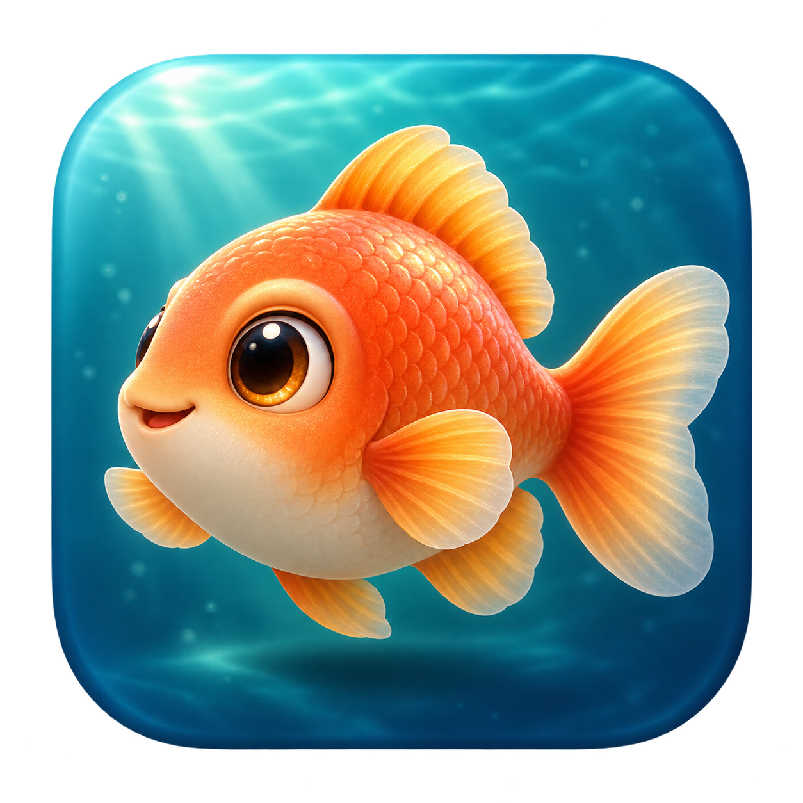
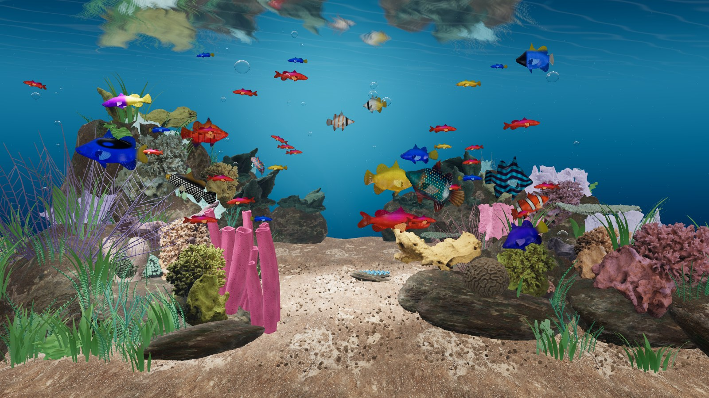
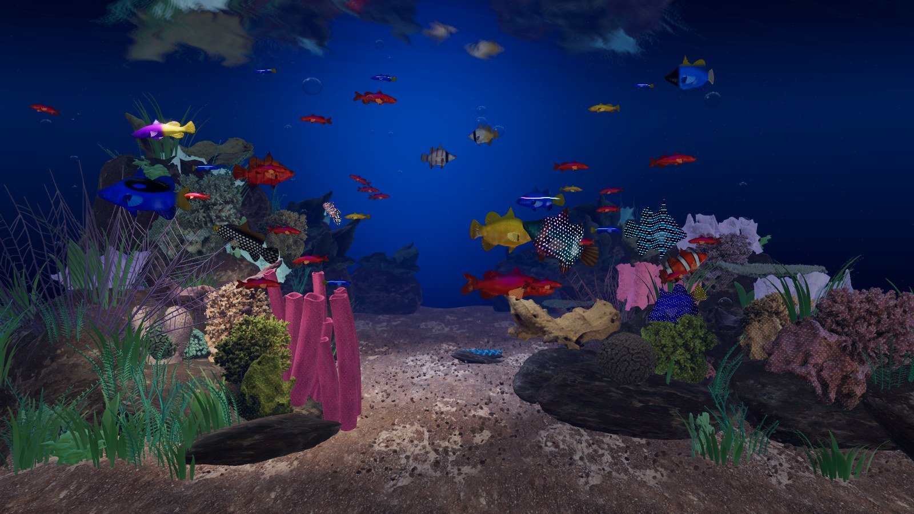
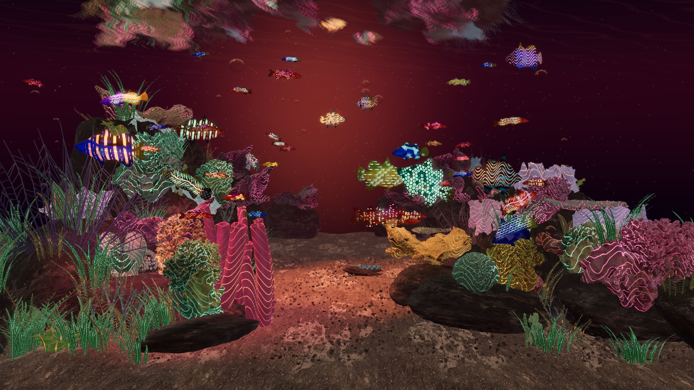

<p align="center"></p>

# 🐠 Reef Live

**A little living ocean for your Mac desktop.** Free, open source, and fully 3D.

Watch colorful fish swim through a planted reef, tap them for a quick reaction, or explore with a drag and a pinch. Reef runs locally in your menu bar, with no account, subscription or internet connection needed during playback.



## Three worlds, one aquarium

| Theme | Mood |
| :--- | :--- |
| ☀️ **Daylight** | Clear blue water, soft corner sunlight, rippling reflections and bright reef colors. |
| 🌙 **UV Night** | Deep ultramarine water with selective fluorescent fish, coral and plant markings. |
| 🪐 **Planet X** | An imagined alien sea with copper light, plum water and shifting bioluminescent patterns. |

| UV Night | Planet X |
| :---: | :---: |
|  |  |

*Screenshots are captured from the running app, not concept renders.*

Choose a theme yourself, follow macOS light/dark appearance, or use **Daily cycle**:

- **7 AM–5 PM:** Daylight
- **5–9 PM:** Planet X
- **9 PM–7 AM:** UV Night

The cycle follows your Mac’s local clock and catches up after sleep.

## What you can do

- **Meet 44 fish:** animated bodies and fins, long curved routes, foreground visits and reef avoidance.
- **Touch the aquarium:** click a fish for a brief faster swim; drag it to a new position. Click scenery to release bubbles.
- **Explore:** drag empty water to pan; scroll or pinch to zoom; reset whenever you like.
- **Enjoy the details:** scanned coral forms, six aquatic plant varieties, moving water reflections and differently sized bubbles.
- **Fill every display:** each monitor gets its own aquarium view beneath desktop icons and app windows.
- **Choose your balance:** High, Balanced and Eco quality; pause anytime. Display sleep pauses animation.

## Get started

**Requirements:** macOS 14 or newer. Apple silicon is the tested platform; Intel builds are not validated. This repository contains source and runtime assets, not an installer.

1. [Build Reef](#build-from-source), then open `build/Reef.app`. You can move it to Applications.
2. Click the little fish in your menu bar and choose **Start desktop wallpaper**.
3. Keep **Interact with desktop aquarium** checked for desktop gestures.
4. Choose **Appearance → Daily cycle**, or select your favorite theme.

Leave Reef running in the menu bar. Closing the preview is fine. **Stop desktop wallpaper** reveals your usual wallpaper. After quitting and reopening Reef, start the wallpaper again.

| Control | Action |
| :--- | :--- |
| Click fish / scenery | Brief fish reaction / a loose burst of bubbles |
| Drag fish / empty water | Move a fish / pan the camera |
| Scroll or pinch | Zoom |
| Right-drag or Option-drag in preview | Orbit |
| Escape / Reset view | Restore the default composition |
| Space / H / D in preview | Pause / hide controls / show rendering stats |

**Need help?** Start with [setup and troubleshooting](docs/BUILDING.md). If High is too demanding, try Balanced or Eco, especially with multiple displays. Physical desktop gestures and Spaces behavior may vary by macOS setup; please [report reproducible issues](https://github.com/hckmstrrahul/reef-live/issues).

## Build from source

Install **Node.js 22+** and **Xcode Command Line Tools** (`xcode-select --install`). A Swift 6 toolchain is required. Blender is optional.

```sh
git clone https://github.com/hckmstrrahul/reef-live.git
cd reef-live
npm ci
npm run app
open build/Reef.app
```

The app bundles everything it needs for offline playback. Local builds are ad-hoc signed, not Apple-notarized. They do not require an Apple Developer membership. See [build notes](docs/BUILDING.md) for browser development, checks and Blender exports.

## How it was built

- **Swift + AppKit + WKWebView** provide the menu bar, desktop windows, display management and native gesture bridge.
- **Three.js + GLSL** render actual 3D meshes with procedural swimming, plant sway, animated pigments, shadows and water optics.
- **threejs-water** supplies the GPU surface-wave solver; a small custom 3D velocity field drives currents and bubble motion.
- **Blender** was used to prepare coral scans and create an optional editable scene export. It is not needed to run the app.
- **Codex** assisted with implementation, iteration and testing. The app icon was made with OpenAI image generation; its [prompt and provenance](assets/icons/generation.json) are included.
- **esbuild, Playwright and Swift Testing** handle bundling and automated checks.

This is a stylized real-time aquarium. Fish share one underlying anatomical model; species-inspired colors and UV effects are artistic. Fluid coupling, caustics and collisions are approximations, not scientific simulation. Read the [architecture and performance notes](docs/ARCHITECTURE.md) for details.

## Credits, licensing and contributions

Reef’s original code is **[MIT licensed](LICENSE)**. Third-party code retains its MIT notices; the fish model, coral scans, textures and HDRI use CC0.

Thanks to [Three.js](https://threejs.org/), [threejs-water](https://github.com/jeantimex/threejs-water), [three-mesh-bvh](https://github.com/gkjohnson/three-mesh-bvh), [Microsoft / Khronos glTF Sample Assets](https://github.com/KhronosGroup/glTF-Sample-Assets/tree/main/Models/BarramundiFish), [Smithsonian Open Access](https://www.si.edu/openaccess) and [Poly Haven](https://polyhaven.com/).

**[Full asset sources, modifications and attributions →](docs/THIRD_PARTY.md)**

Ideas, bug reports, better fish anatomy, accessibility improvements and performance work are welcome. See [CONTRIBUTING.md](CONTRIBUTING.md) and [SECURITY.md](SECURITY.md).
